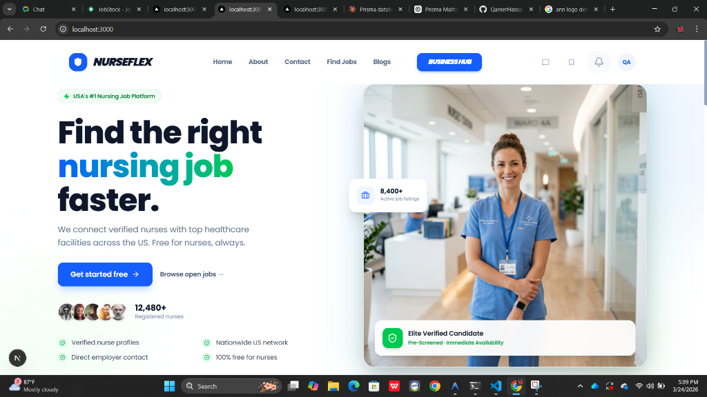

<div align="center">

# 🏥 NurseFlex



**The Premium Job Platform for Healthcare Professionals**

[](https://nextjs.org/)
[](https://nestjs.com/)
[](https://www.mongodb.com/)
[](https://tailwindcss.com/)

</div>

---

## ✨ The Vision

**NurseFlex** is a high-end, specialized job platform designed exclusively for the nursing community. It bridges the gap between healthcare professionals and medical institutions with a seamless, intuitive, and highly aesthetic interface.

Built with an uncompromising focus on **Premium User Experience**, the platform features a custom-tailored, modern design system utilizing sleek blue and green gradients, glassmorphism elements, and simplified workflows to make finding, applying, and managing healthcare jobs utterly effortless.

## 🚀 Key Features

### For Nurses (Job Seekers)
- 💎 **Premium Aesthetic**: A modern, cohesive look utilizing fluid animations and deep blue/green gradients across the entire application flow.
- 📝 **Frictionless Applications**: Effortless, multi-step application process with intelligent state persistence—never lose your progress.
- 💼 **Unified Job Board**: Browse jobs from top-tier hospitals (Mayo Clinic, Cleveland Clinic, Mass General) with integrated, verified hospital branding.
- 🎯 **Smart Dashboard**: Track applications, saved jobs, and profile completion in a clean, distraction-free full-width dashboard.
- 🔒 **Secure Experience**: Robust authentication via NextAuth.js ensuring your data and credentials stay protected.

### For Institutions (Employers/Admins)
- 📊 **Comprehensive Analytics**: Real-time stats on applications (Pending, Approved, Interviewing) visualized beautifully.
- 📑 **Application Management**: Review candidate profiles, resumes, and work history with comprehensive detail panes.
- 📢 **Job Posting Hub**: A streamlined, luxury dashboard for creating, sponsoring, and managing hospital job listings.
- 💳 **Tiered Subscriptions**: Built-in posting limits and business subscription models.

---

## 💻 Technology Stack

NurseFlex is built upon a modern, high-performance, and scalable architecture:

### Frontend
- **Framework**: Next.js 16 (App Router + Turbopack)
- **Styling**: Tailwind CSS (Custom Design System)
- **Icons & Visuals**: Lucide React
- **State & Data**: React Hooks, Axios

### Backend & Database
- **Framework**: NestJS (TypeScript)
- **Database**: MongoDB Atlas
- **ORM**: Prisma
- **Storage**: Local/Cloud Uploads for Resumes

---

## 🏗 Setup & Installation

### Prerequisites
- Node.js (v18 or higher)
- MongoDB Database cluster (Atlas recommended)
- npm or yarn

### Quick Start

1. **Clone the repository**
   ```bash
   git clone https://github.com/QamerHassan/NurseFlex-A-Nurse-job-platform.git
   cd NurseFlex-A-Nurse-job-platform
   ```

2. **Frontend Setup**
   ```bash
   cd nursingplatform
   npm install
   # Create a .env.local file with your NextAuth and API URL variables
   npm run dev
   ```

3. **Backend Setup**
   ```bash
   cd ../backend
   npm install
   # Create a .env file with your DATABASE_URL (MongoDB)
   npx prisma generate
   npm run start:dev
   ```

---

<div align="center">
  <h3>✨ Crafted with excellence by Qamer Hassan</h3>
  <p>
    <a href="https://github.com/QamerHassan">
      
    </a>
  </p>
</div>
